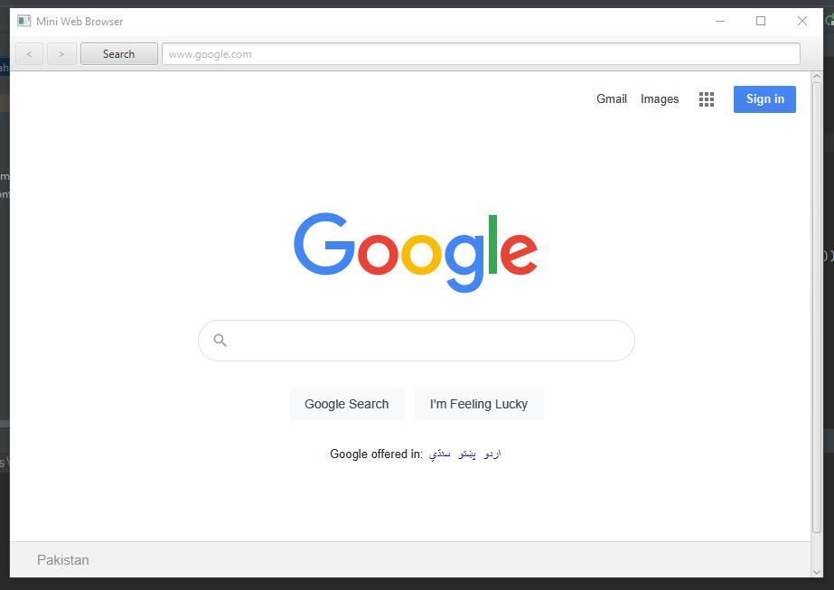
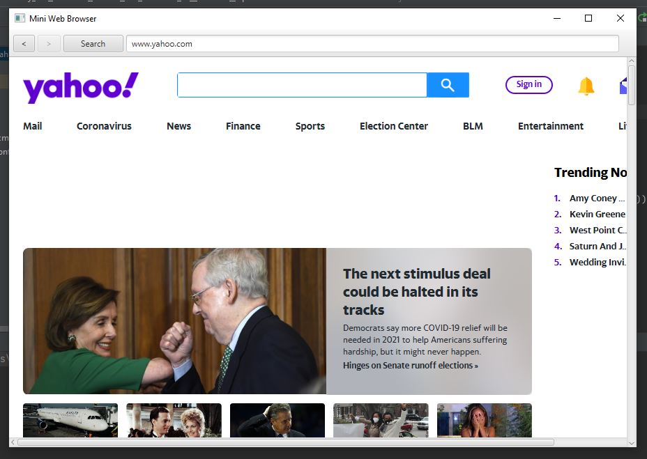
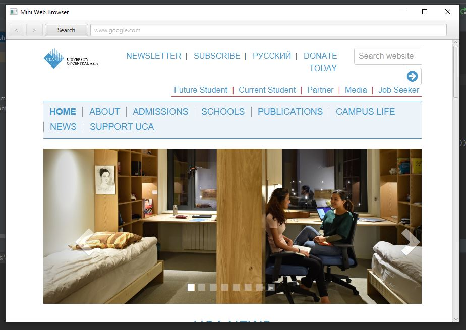

# Mini web browser using javafx and Scenbuilder 
# Software needed for this application
## JavaFX SDK ( https://openjfx.io/
## Scene Builder (https://gluonhq.com/products/scene-builder/)
## IntelliJ IDEA ( https://www.jetbrains.com/idea/
##
## In order to setup JavaFX project, follow the instruction on this link: (https://openjfx.io/openjfx/docs/#introduction)
#
## For VM options : 
--module-path "C:\Users\jahanzaib.danish\Desktop\OOPs Java\openjfx-11.0.2_windows-x64_bin-sdk\javafx-sdk-11.0.2\lib" --add-modules=javafx.swing,javafx.graphics,javafx.fxml,javafx.media,javafx.web --add-reads javafx.graphics=ALL-UNNAMED --add-opens javafx.controls/com.sun.javafx.charts=ALL-UNNAMED --add-opens javafx.graphics/com.sun.javafx.iio=ALL-UNNAMED --add-opens javafx.graphics/com.sun.javafx.iio.common=ALL-UNNAMED --add-opens javafx.graphics/com.sun.javafx.css=ALL-UNNAMED --add-opens javafx.base/com.sun.javafx.runtime=ALL-UNNAMED
#

#

#

#

